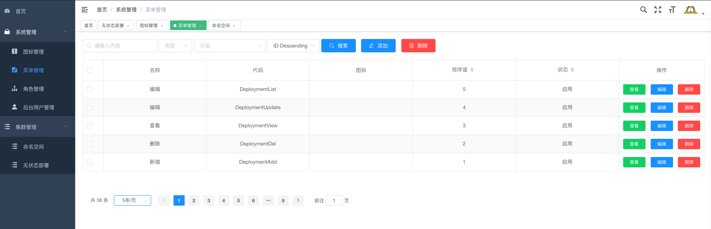
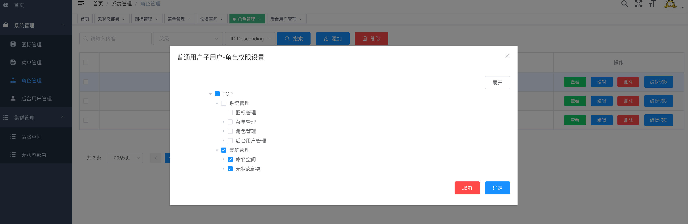
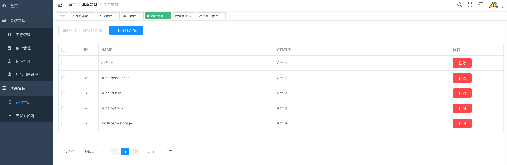
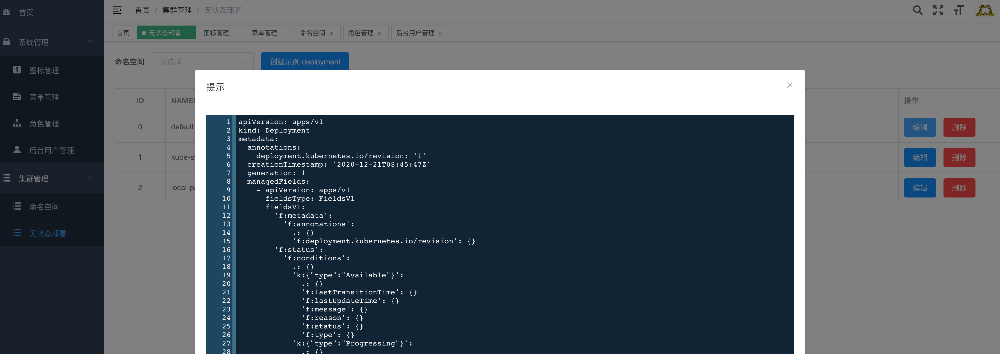
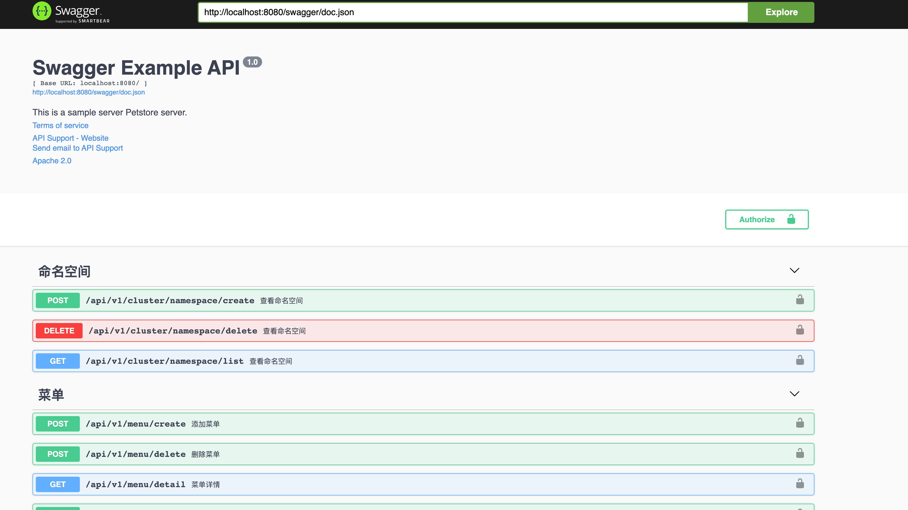

# go-example-app

<!-- PROJECT SHIELDS -->


<!-- ABOUT THE PROJECT -->
## About The Project

This is a `gin + vue`  example app, include user manage , rbac permision, 
menu generator and kubernetes manage. 

### Using Compoment

This Demo Project Using These Compoment, Thanks for these project: 

- gin
- vue-element-admin
- mysql
- redis
- kubernetes
- swagger
- prometheus-metrics
- cors
- casbin
- gorm
- zap

### Project Structure

The project not batter structure, beacuse I'm a beginner, 😄.

```
├── LICENSE
├── Makefile # simple run commad
├── README.md 
├── docker-compose.yaml # run this project on local
├── go.mod
├── go.sum
├── server  # golang backend  api-server
└── website # vue frontend project
```

## Try the project

pre required need kubernetes, you can use kind create it.

### Local

after run this project. nedd docker-compose kubernetes cluster and kubeconfig.


change kubeconfig path:

```bash
kubernetes:
  # type in or out cluster type
  type: out
  # type out need kubeconfig path
  config: /root/.kube/config
```

run docker-compose

```bash
make run
```

run backend 

```bash
cd server
go run main.go --config configs/dev.yaml
```

run frontend

```bash
yarn dev
```

### SnapShot

<details>
<summary>Expand view</summary>
    <pre>
        <code>.
        <br/><br/>
        <br/><br/>
        <br/><br/>
        <br/><br/>
        <br/><br/>
        </code>
    </pre>
</details>


